<p align="center">
  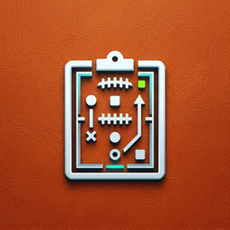
</p>

<h1 align="center">Fantasy Command Center</h1>

<p align="center">
  <b>Your Sleeper league, answered.</b><br>
  A native iPhone, iPad and Mac app that tells you who to start, who to grab and who to trade for —<br>
  from real data, with every number saying where it came from.
</p>

<p align="center">
  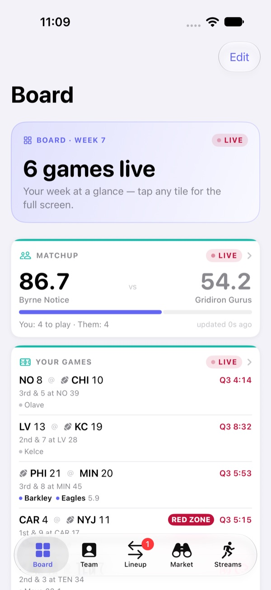
  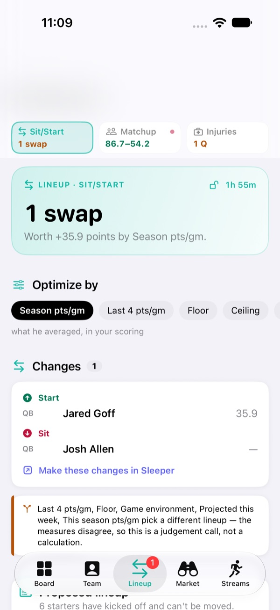
  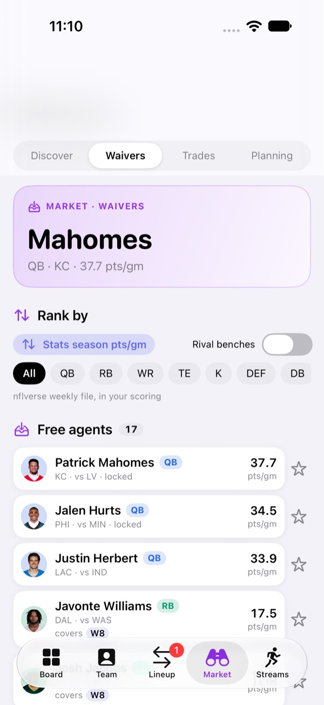
  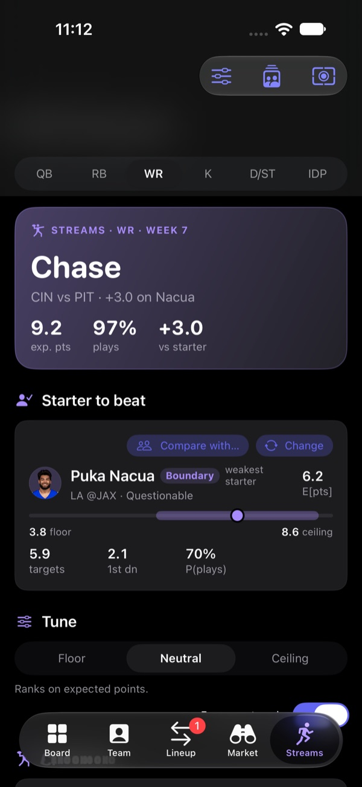
</p>

---

## Two apps, one command center

| | **Native app** (`apple/`) | **Web app** (`src/`) |
|---|---|---|
| Runs on | iPhone, iPad, Mac | Any browser |
| Built with | SwiftUI · three Swift packages (FCCore, FCData, FCApp) | React 18 · Vite · Tailwind |
| Best for | Game day, lineups, waivers, streams, trades, live scores | Draft prep and research |
| Setup | Open in Xcode — [below](#running-the-native-app) | `npm install && npm run dev` — [below](#the-web-app) |

Both read your league straight from Sleeper's free API. Neither needs an account, a server or a subscription.

---

## A tour of the iPhone app

Five tabs, each with its own colour so you always know where you are — **Board** (indigo), **Team** (blue), **Lineup** (teal), **Market** (purple) and **Streams** (each position's colour). Every screen opens with the one answer it exists to give, then the evidence, then where the numbers came from.

### Board — the week at a glance

<table><tr><td align="center" valign="top"><br><sub>Live games and your matchup</sub></td><td align="center" valign="top">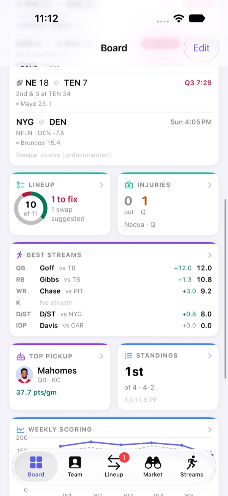<br><sub>Tiles you pick and reorder</sub></td><td align="center" valign="top">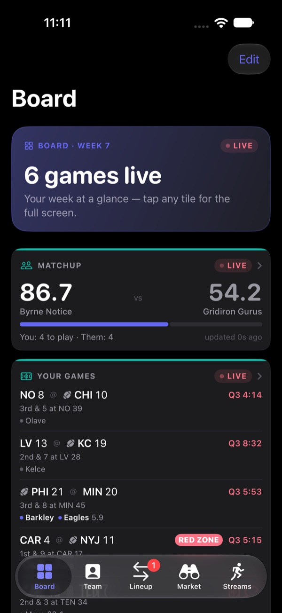<br><sub>Dark mode</sub></td></tr></table>

- **Live matchup and your players' games** — score, quarter, clock, who has the ball and a red-zone flag, refreshed every minute while games are on (and not at all when they aren't).
- **Tiles you choose** — lineup readiness, injuries, the best stream at every position your league starts, the top pickup, standings, weekly scoring, byes and news. Edit to hide and reorder; each tile opens its full screen.

### Lineup — Sit/Start · Matchup · Injuries

<table><tr><td align="center" valign="top"><br><sub>Swaps and what they're worth</sub></td><td align="center" valign="top">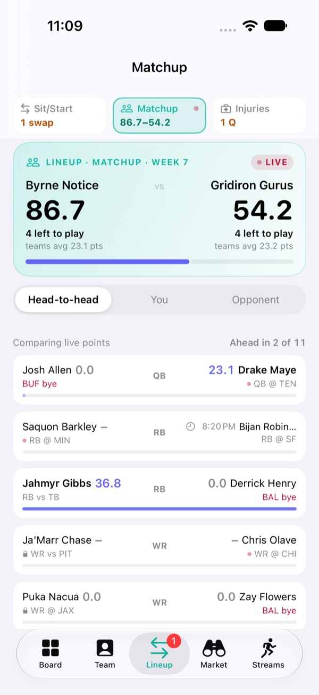<br><sub>Slot-by-slot head to head</sub></td><td align="center" valign="top">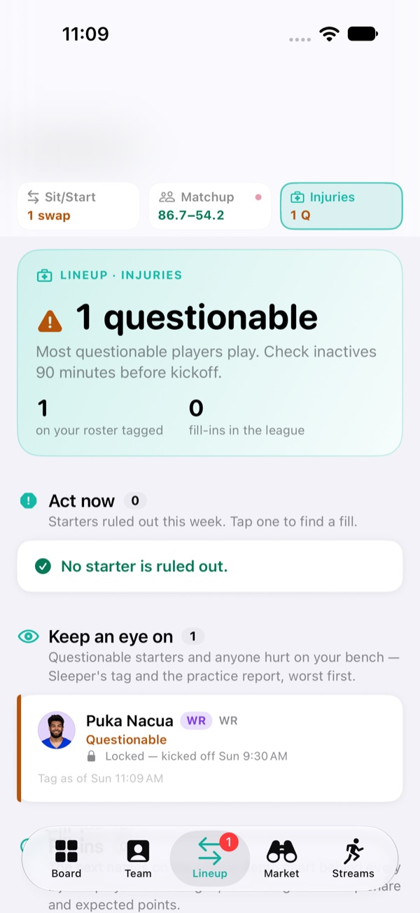<br><sub>Act now vs keep an eye on</sub></td></tr></table>

- **Sit/Start** optimises your lineup on the basis you choose — season average, recent form, floor, ceiling, projections or the app's own model — and tells you when the measures disagree instead of pretending there's one right answer.
- **Matchup** pairs every slot against your opponent's, live during games.
- **Injuries** splits your roster into *act now* (starters ruled out) and *keep an eye on*, names the fill-ins behind every injured player in the league, and shows which rivals are short.
- Three status cards across the top show each section's state from the others.

### Team

<table><tr><td align="center" valign="top">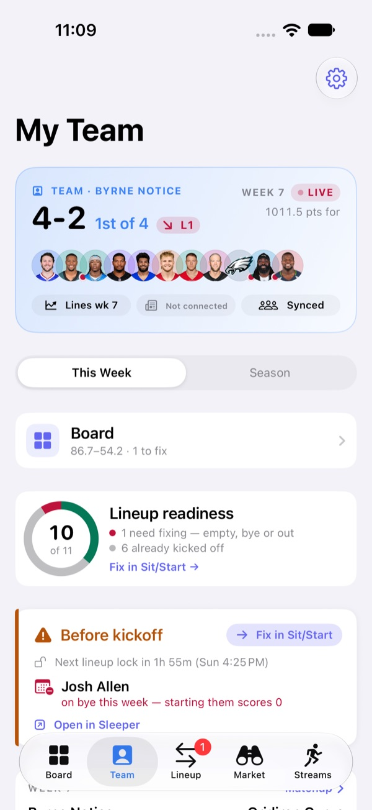<br><sub>Record, rank, streak and what to fix</sub></td><td align="center" valign="top">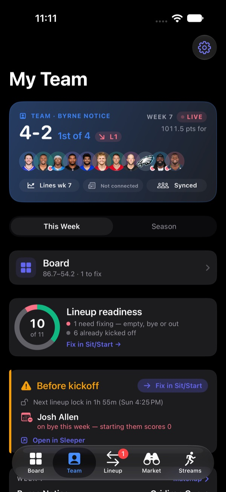<br><sub>Dark mode</sub></td></tr></table>

Your record and rank, lineup readiness as a ring, what to fix before kickoff, and — on the Season view — standings, points left on your bench, weekly scoring against the league and how your draft paid off.

### Market — Discover · Waivers · Trades · Planning

<table><tr><td align="center" valign="top">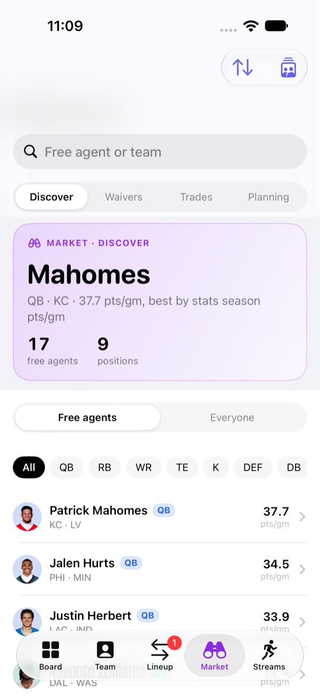<br><sub>Every free agent, any sort</sub></td><td align="center" valign="top"><br><sub>The #1 claim and your FAAB</sub></td><td align="center" valign="top">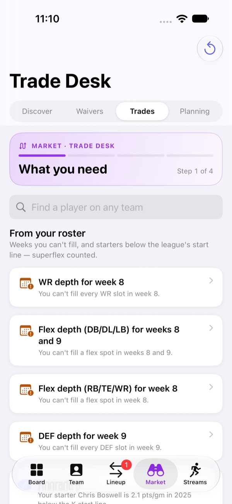<br><sub>A four-step trade builder</sub></td><td align="center" valign="top">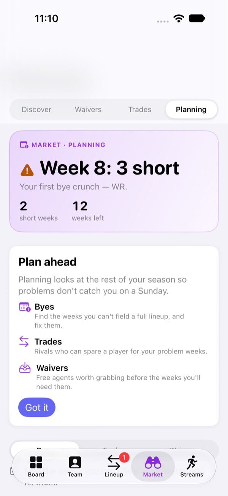<br><sub>Your next bye crunch</sub></td></tr></table>

- **Discover** — every free agent at the positions your league starts, with a page per player (schedule and strength of schedule, trends, news) and side-by-side comparison.
- **Waivers** — ranked on one named measure at a time, priced by your league's own waiver rules and FAAB.
- **Trade desk** — start from a need (a bye week, a weak starter), find rivals who can fill it, build a deal that works for both lineups, and write the pitch.
- **Planning** — the weeks you can't field a full lineup, and how to fix them before they arrive.

### Streams — QB · RB · WR · K · D/ST · IDP

<table><tr><td align="center" valign="top">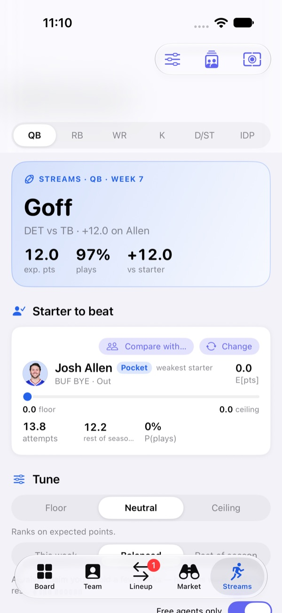<br><sub>Best stream vs your starter</sub></td><td align="center" valign="top"><br><sub>Each position in its own colour</sub></td></tr></table>

Weekly streaming for every position, projected in your league's scoring from game lines, matchups, usage and weather — with a floor-to-ceiling range for each player, a rest-of-season view, and the gain over the starter you'd bench.

### A way back from anywhere

<table><tr><td align="center" valign="top">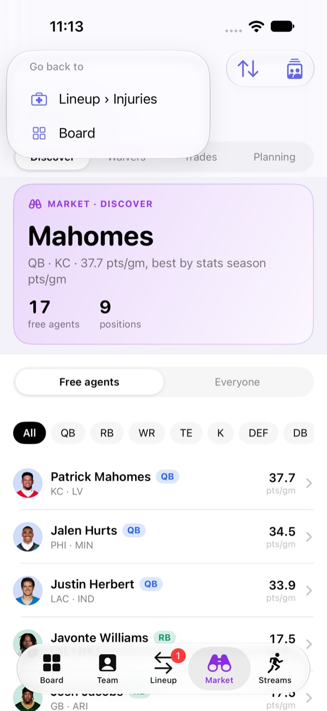<br><sub>Hold the back pill for the trail</sub></td></tr></table>

Every screen change is remembered. A pill at the top-left ("‹ Board") goes back one step; press and hold for everywhere you've been. Tapped the wrong tab? One tap undoes it.

---

## On iPad and Mac: workspaces

<p align="center">
  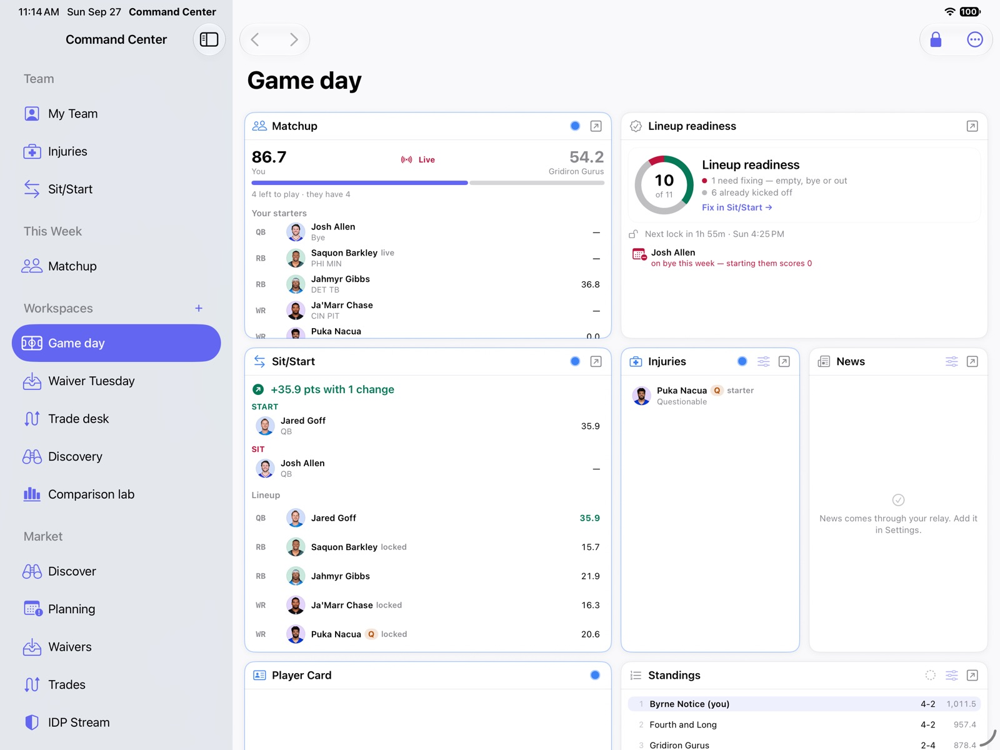
  <br><sub><b>Game day</b> — matchup, lineup readiness, sit/start, injuries, news and standings on one screen</sub>
</p>
<p align="center">
  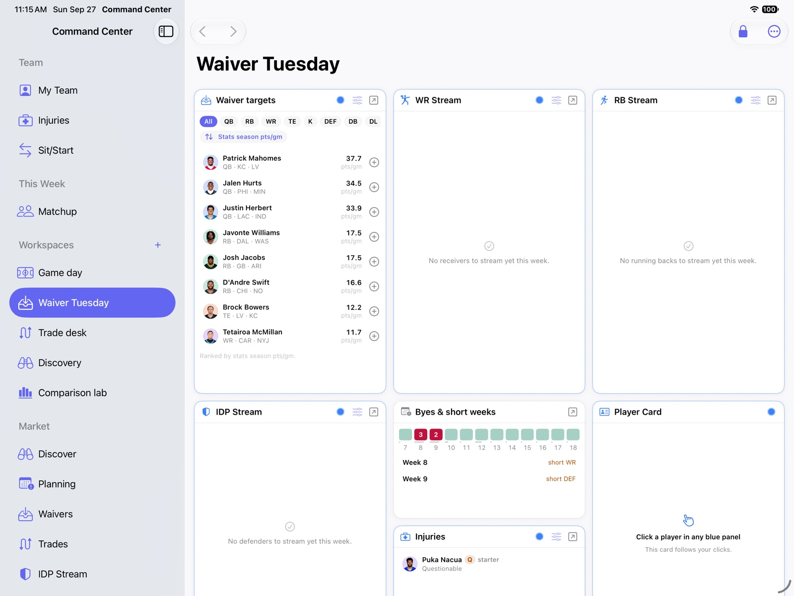
  <br><sub><b>Waiver Tuesday</b> — every pickup list side by side, with byes and injuries</sub>
</p>

On a bigger screen the app becomes a trading desk: **workspaces** of resizable panels you arrange yourself, with five presets (Game day, Waiver Tuesday, Trade desk, Discovery, Comparison lab).

- **Linked panels** — click a player in one panel and every panel of the same link colour follows him; ⌘-click to add him to a comparison of up to four.
- **Comparison charts** — weekly trend lines for everyone you're comparing, on any of fourteen stats, raw or smoothed.
- **Drag to resize** — other panels move out of the way and float back.
- **Back and forward** in the toolbar and Go menu (⌘[ and ⌘]).

---

## Designed to be read at a glance

<table><tr>
<td align="center" valign="top">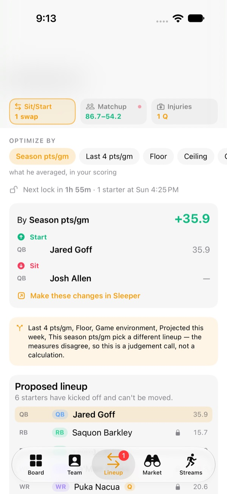<br><sub>Before</sub></td>
<td align="center" valign="top"><br><sub>After</sub></td>
<td align="center" valign="top">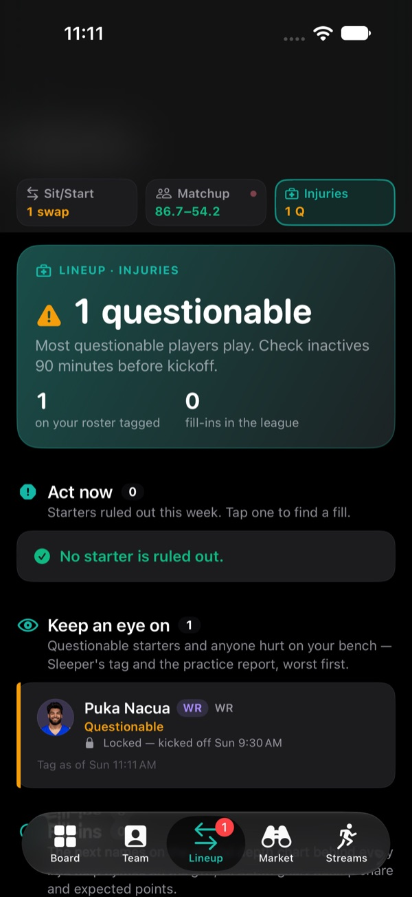<br><sub>Dark mode</sub></td>
<td align="center" valign="top">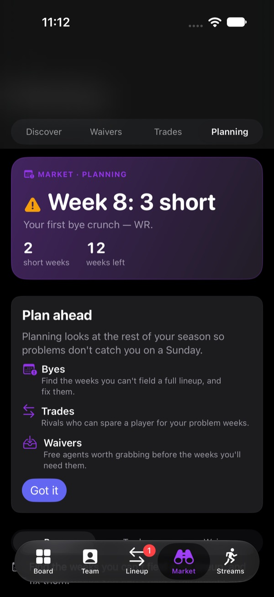<br><sub>Dark mode</sub></td>
</tr></table>

- **One answer first.** Every screen leads with a hero that answers its question — "1 swap, worth +35.9", "Week 8: 3 short", "Goff: +12.0 on Allen".
- **Colour means one thing each.** The accent is for things you can press. Green, amber and red are verdicts only, always with an icon. Each tab has its own hue.
- **Contrast from depth, not decoration.** Raised cards on a recessed page, with room between sections. Text and status colours are checked against WCAG contrast in light and dark mode by the test suite.
- **Sources stay honest but out of the way** — folded into *About this data* at the bottom of each screen.

---

## Where the numbers come from

| Source | Used for |
|---|---|
| [Sleeper](https://docs.sleeper.com) | Your league, rosters, scoring rules, matchups and live points; weekly stat lines and Rotowire projections; player news; live game states (score, clock, possession) |
| ESPN Fantasy | Your league, rosters, scoring rules and matchups when it lives on ESPN. Private leagues work: you sign in on ESPN's own page and the app keeps only ESPN's two session cookies, in your Keychain, sent only to ESPN |
| [nflverse](https://github.com/nflverse/nflverse-data) | Season stats, snap counts, depth charts, official injury reports, schedules and closing lines — refreshed twice daily by a GitHub Action |
| [ffopportunity](https://github.com/ffverse/ffopportunity) | Expected fantasy points (xFP) — what a player's usage should have scored |
| [DynastyProcess](https://github.com/dynastyprocess/data) | ADP, bye weeks and the ID crosswalk between sources |

A few rules the app keeps: a number that doesn't exist is shown as *missing*, never as zero. Estimates are labelled as estimates. Undocumented feeds are named as such and fail soft.

---

## Running the native app

```sh
cd apple
open FantasyCommandCenter.xcodeproj
```

Pick an iPhone simulator, an iPad or **My Mac** and run. In Settings, enter your Sleeper username and pick your league — or choose ESPN, sign in on ESPN's page, and paste your league's id or address.

**No league handy?** Add `-FCCDemoLeague` to the scheme's launch arguments (Product › Scheme › Edit Scheme › Arguments) to open a complete demo league frozen on a week-7 Sunday afternoon — which is what these screenshots show.

Tests run without a simulator from each package:

```sh
cd apple/Packages/FCApp && swift test
```

The architecture, data model and every screen are documented in [`apple/README.md`](apple/README.md).

---

## The web app

The original React app, which the native app grew out of. It runs entirely in your browser — no backend, no database.

### What it does

| Page | What's live |
|------|-------------|
| **Draft** | Full active player list from Sleeper with consensus ADP, real bye weeks, injury status, trending adds/drops, watchlist, search and filters. During a live draft, drafted players strike through and the board shows your pick countdown |
| **Draft Plan** | Ranked targets per position with your notes and named fallbacks. Once the draft starts, targets that are gone strike through and the next surviving fallback is marked |
| **Player Drawer** | Click any player for context, 2025 season stats, an evaluation scored against real positional cohorts, and your saved research notes |
| **Research** | Freeform note cards tied to players — tag by injury, depth chart, role change, target share, etc. |
| **Dashboard** | Roster/matchup data shell (in progress) |
| **Sit / Start** | Coming soon |
| **Trade Analyzer** | Coming soon |
| **Odds** | Coming soon |

#### How the numbers are produced

Every score is a percentile against a **real cohort** — the qualifying players at
that position last season. Metrics nobody publishes for free (yards per route
run, separation, OL grade, first-read rate, red-zone targets, snap share) are
**excluded from the weighting rather than estimated**, and each score reports what
share of its model weight came from real data. Where there is nothing real to
work with — a rookie with no NFL season, a team defense — the app says so
instead of showing a number.

---

### Before you start

You need one thing installed on your computer no matter what:

#### Node.js (v18 or later)

Node.js is the JavaScript runtime that powers the development server and the data preprocessing script.

- Go to [nodejs.org](https://nodejs.org) and download the **LTS** version
- Run the installer — it also installs `npm` automatically
- Verify it worked by opening a terminal and running:

```
node --version
npm --version
```

Both commands should print a version number. If they do, you're good.

---

### Installation

There are two ways to get the code onto your computer. **Pick one.**

---

#### Option A — Download as a ZIP (no Git required)

This is the easiest method if you've never used Git or the terminal for downloading code.

**Step 1 — Download the ZIP**

Go to [github.com/Sidebyrner/Football-Command-Center](https://github.com/Sidebyrner/Football-Command-Center) in your browser.

Click the green **"< > Code"** button near the top right of the page, then click **"Download ZIP"**.


**Step 2 — Extract the ZIP**

- On **Mac**: double-click the downloaded `.zip` file. A folder called `Football-Command-Center-main` (or similar) will appear next to it.
- On **Windows**: right-click the `.zip` file and choose **"Extract All…"**, then click **Extract**.

**Step 3 — Open a terminal inside that folder**

- On **Mac**: right-click the extracted folder in Finder and choose **"New Terminal at Folder"**. (If you don't see that option, open Terminal and drag the folder onto the Terminal window to set the path, then press Enter.)
- On **Windows**: open the extracted folder in File Explorer, click the address bar at the top, type `cmd`, and press Enter. A Command Prompt window opens already pointed at that folder.

**Step 4 — Install dependencies**

```bash
npm install
```

This downloads all the libraries the app needs. It may take 30–60 seconds. You only need to do this once.

> **Note:** When the repo is updated you'll need to re-download the ZIP and repeat from Step 1. If you want automatic updates in the future, switch to Option B.

---

#### Option B — Clone with Git

If you have Git installed and want to pull updates easily in the future, use this method instead.

Git lets you download and update the code with a single command. Install it from [git-scm.com](https://git-scm.com) if you don't have it, then verify with `git --version`.

Open a terminal (on Mac: search Spotlight for "Terminal"; on Windows: search for "Command Prompt" or "PowerShell").

**Step 1 — Download the code**

```bash
git clone https://github.com/Sidebyrner/Football-Command-Center.git
```

**Step 2 — Move into the project folder**

```bash
cd Football-Command-Center
```

**Step 3 — Install dependencies**

```bash
npm install
```

This downloads all the libraries the app needs. It may take 30–60 seconds. You only need to do this once.

**To pull future updates**, run this from inside the project folder:

```bash
git pull
```

---

### Environment setup (optional)

The app works without this step, but it lets you set default values so you don't have to change them in the UI every time.

**Step 1 — Copy the example file**

```bash
cp .env.example .env
```

On Windows Command Prompt use `copy` instead of `cp`:

```
copy .env.example .env
```

**Step 2 — Open `.env` in any text editor and fill it in**

```
VITE_ODDS_API_KEY=your_key_here
VITE_DEFAULT_SEASON=2026
VITE_DEFAULT_WEEK=1
```

- `VITE_DEFAULT_SEASON` — the NFL season year (e.g. `2026`)
- `VITE_DEFAULT_WEEK` — the current week number (1–18)
- `VITE_ODDS_API_KEY` — only needed if you want the Odds page (see [The Odds API](#the-odds-api-optional) below)

Save the file. The `.env` file is intentionally not committed to Git — it stays private on your machine.

---

### Running the app

```bash
npm run dev
```

You'll see output like:

```
  VITE v6.x.x  ready in 300ms

  ➜  Local:   http://localhost:5173/
```

Open [http://localhost:5173](http://localhost:5173) in your browser. The app loads instantly — no build step needed in dev mode.

To stop the server, press `Ctrl + C` in the terminal.

---

### First-time setup (inside the app)

The app will redirect you to **Settings** the first time you open it. This is where you connect your Sleeper account.

#### Step 1 — Enter your Sleeper username

Type your **Sleeper username** (not your email — the public @username you see in the app) and click **Look up**. The app confirms your account and loads your leagues automatically.

#### Step 2 — Select your league

A dropdown appears with your NFL leagues for the current season. Pick the one you want to work with.

#### Step 3 — Set season and week

Match these to the current NFL season and week. The defaults from your `.env` file pre-fill these.

#### Step 4 — Check your league scoring

Selecting a league automatically pulls its **real scoring rules** from Sleeper —
PPR format, first-down bonuses, kicker tiers, IDP. These drive every evaluation
score, so it is worth expanding the panel and confirming they match your league.

If the panel says **ASSUMED DEFAULT**, the app is running on built-in guesses
rather than your league's rules; click **Pull from Sleeper**.

#### Step 5 — Save

Click **Save Settings**. You'll be redirected to the dashboard. Your settings are saved in your browser's local storage, so you only need to do this once per browser.

---

### The Odds API (optional)

The Odds page requires a free API key from [The Odds API](https://the-odds-api.com).

- Sign up for free — the free tier gives you 500 requests per month
- Copy your key from their dashboard
- Paste it into the Odds API Key field in Settings (or add it to your `.env` file as `VITE_ODDS_API_KEY`)

You can use every other feature without this key.

---

### Refreshing the data

The repo ships with the generated data files already in `public/data/`, so the
app works immediately after `npm install`. Re-run the fetch to pull the latest
consensus ranks:

```bash
npm run preprocess-nflverse
```

This downloads and processes four things (1-3 minutes):

| File | Contents |
|------|----------|
| `nflverse-seasons.json` | Aggregated 2025 + 2024 season stats per player |
| `cohorts.json` | Sorted positional distributions used for percentile scoring |
| `player-ids.json` | Sleeper ↔ nflverse ↔ FantasyPros ID crosswalk |
| `adp.json` | Expert consensus ranks and bye weeks |

To include more history:

```bash
npm run preprocess-nflverse:all
```

Restart the dev server afterwards.

> **Before a draft:** run this the morning of, so consensus ranks reflect the
> latest news. Commit the result — then a network failure on draft day cannot
> leave you with an empty board.

### Project structure

```
Football-Command-Center/
├── public/data/                    ← generated by the preprocess script (committed)
│   ├── nflverse-seasons.json       ← aggregated season stats
│   ├── cohorts.json                ← positional percentile distributions
│   ├── player-ids.json             ← Sleeper ↔ nflverse ↔ FantasyPros crosswalk
│   └── adp.json                    ← consensus ranks + bye weeks
├── scripts/
│   └── preprocess-nflverse.mjs     ← fetches and builds all four files above
├── src/
│   ├── components/
│   │   ├── draft/                  ← player table, filters, drawer, live draft status
│   │   ├── mockdraft/              ← draft plan target cards + player search
│   │   ├── eval/                   ← evaluation panel, league scoring settings
│   │   ├── layout/                 ← Sidebar, Header, ErrorBoundary
│   │   └── research/               ← note cards
│   ├── hooks/
│   │   ├── useDraftPlayers.js      ← Sleeper players joined to ADP + byes
│   │   ├── useLiveDraft.js         ← polls draft picks while a draft is running
│   │   ├── useCohorts.js           ← loads percentile cohorts
│   │   ├── useLeagueScoring.js     ← pulls your league's real scoring rules
│   │   └── usePlayerStats.js       ← per-player season history
│   ├── services/
│   │   ├── sleeperService.js       ← Sleeper league/roster/draft helpers
│   │   ├── nflverseService.js      ← season stats + metric mapping
│   │   ├── cohortService.js        ← real positional distributions
│   │   └── marketService.js        ← ADP, byes, and the ID crosswalk
│   ├── pages/                      ← Draft, Draft Plan, Research, Settings, …
│   ├── store/                      ← app settings, research, scoring, draft plan
│   └── utils/
│       ├── evaluationEngine.js     ← weekly + draft scoring models
│       ├── sleeperScoring.js       ← Sleeper scoring_settings → profile
│       ├── percentile.js           ← percentile rank against a cohort
│       └── cache.js                ← localStorage TTL cache
├── .env.example
└── package.json
```

---

### Data sources

| Source | What it provides | How it's used |
|--------|-----------------|---------------|
| [Sleeper API](https://docs.sleeper.com) | Player metadata, league scoring settings, rosters, matchups, live draft picks, trending | Primary layer — all live fantasy context, including your league's real scoring rules. Free, no key required. |
| [nflverse](https://nflreadr.nflverse.com) | Season stats and advanced metrics (target share, air yards share, WOPR, RACR, ADOT) | Feeds every evaluation score and the percentile cohorts. |
| [DynastyProcess](https://github.com/dynastyprocess/data) | FantasyPros expert consensus ranks, bye weeks, and the Sleeper/nflverse/FantasyPros ID crosswalk | Supplies ADP and bye weeks, which Sleeper does not publish. |
| [The Odds API](https://the-odds-api.com) | NFL game lines and player props | Optional — requires a free API key. |

All data is fetched directly in your browser or preprocessed locally. There is no server or database.

---

### Available commands

| Command | What it does |
|---------|-------------|
| `npm run dev` | Start the local development server |
| `npm run build` | Build a production-ready version into `/dist` |
| `npm run preview` | Preview the production build locally |
| `npm run preprocess-nflverse` | Refresh stats, cohorts, ADP and bye weeks (2025 + 2024) |
| `npm run preprocess-nflverse:all` | Same, plus the 2023 season |

---

### Troubleshooting

**The page is blank or shows an error about Settings**

Open [http://localhost:5173/settings](http://localhost:5173/settings) and complete the first-time setup. The app requires a Sleeper username and league before most pages load.

**"Username not found on Sleeper"**

Make sure you're typing your Sleeper **username** (the public @handle), not your email address. You can find it in the Sleeper app under your profile.

**No leagues appear after looking up my username**

The league lookup is tied to the season year in Settings. If your league ran in a different year than what's set, update the Season field first and click Look up again.

**The Stats tab says "Historical data not loaded"**

Run `npm run preprocess-nflverse` from the project folder, then restart the dev server.

**A player shows "No score available"**

That is deliberate, not a bug. It means the model has no real data for them —
usually a rookie with no NFL season, or a team defense, which the statistical
model does not cover. The app declines to score rather than showing a number
built on assumptions.

**ADP shows an asterisk**

That player was matched to consensus rankings by name rather than by player ID.
It is usually right, but worth a glance before you draft them.

**npm install fails**

Make sure you're running Node.js v18 or later (`node --version`). If you're on an older version, download the LTS from [nodejs.org](https://nodejs.org) and reinstall.

**Port 5173 is already in use**

Either stop whatever is running on that port, or Vite will automatically try the next port (5174, 5175, etc.) and print the actual URL in the terminal.

---

### Tech stack

- **React 18** — UI framework
- **Vite** — dev server and build tool
- **Tailwind CSS** — styling
- **Zustand** — state management (settings and research notes persist across sessions)
- **Recharts** — chart components
- **Lucide React** — icons
